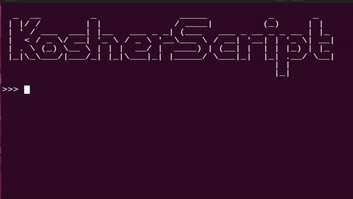

# KosherScript

<p align="center">
  
</p>

KosherScript is a simple programming language interpreter in hebrew that supports basic arithmetic operations, conditional statements (`אם`/`אחרת`), loops (`בזמן`), and variable assignments. The code includes a lexer, parser, and interpreter to execute the provided programming language syntax.

## Demonstration



## Features

- Supports basic arithmetic operations: addition, subtraction, multiplication, and division.
- Handles conditional statements using `אם`, `אחרת`, and `אזי` keywords.
- Supports loops with `בזמן` keyword.
- Provides variable assignments using the `=` operator.
- Recognizes integers and floating-point numbers.
- Basic error handling for unexpected tokens and invalid input.

## Code Structure

- `Token`: Represents different types of tokens in the language.
- `Nodes`: Classes representing various types of nodes in the Abstract Syntax Tree.
- `SymbolTable`: Represents a symbol table that stores variable values.
- `Lexer`: Converts the input text into a list of tokens.
- `Parser`: Takes a list of tokens and constructs an Abstract Syntax Treefor the interpreter.
- `Interpreter`: Executes the Abstract Syntax Tree and evaluates the expressions.
- `KosherScript`: The entry point of the program that takes user input, processes it, and prints the result.

## Usage

### **Make sure you are using command line that support rtl(right to left) text.**

1. **Run the interpreter**:

   ```shell
   python main.py
   ```

2. **Input**:

   - You can input expressions directly in the console prompt.
   - Supported expressions include arithmetic operations, variable assignments, conditional statements, and loops.

3. **Examples**:

   - Arithmetic: `>>> 2 + 3 * 5`
   - Variable Assignment: `>>> א = 10`
   - Conditional Statements: `>>> אם א > 5 אזי ב = 1 אחרת ב = 0 סוף`
   - Loops: `>>> בזמן א < 10 אזי א = א + 1 סוף`

4. **Exit**:
   - Type `צא` to close the interpreter.

## BNF Grammar

The following BNF grammar describes the simple programming language supported by this interpreter:

```
<program> ::= <statement>_
<statement> ::= <expr> | <if_expr> | <while_expr> | <assignment> | <block>
<expr> ::= <arithmetic_expr> | <term> | <factor> | <identifier_expr>
<arithmetic_expr> ::= <term> ((PLUS | MINUS) <term>)_
<term> ::= <factor> ((MUL | DIV) <factor>)_
<factor> ::= INT | FLOAT | LPAREN <expr> RPAREN | (PLUS | MINUS) <factor> | <identifier_expr>
<identifier_expr> ::= IDENTIFIER ASSIGNMENT <expr>
<if_expr> ::= WORD_IF <expr> WORD_THEN <block> (WORD_ELSE <block>)? WORD_END
<while_expr> ::= WORD_WHILE <expr> WORD_DO <block> WORD_END
<block> ::= <statement>_
<assignment> ::= IDENTIFIER ASSIGNMENT <expr>
```

## Variable Names

- Maximum length of a variable name: 11 characters as the length of the longest word in the Bible

## Dependencies

- Python 3.x

## Development

- Add new features or modify existing ones by updating the lexer, parser, and interpreter.
- To add new keywords or operations, update the relevant sections in `Lexer`, `Parser`, and `Interpreter` classes.

## Authors

- [@Seadox](https://www.github.com/seadox)
- [@Zalts110](https://github.com/Zalts110)

## License

This project is licensed under the [MIT License](LICENSE).
